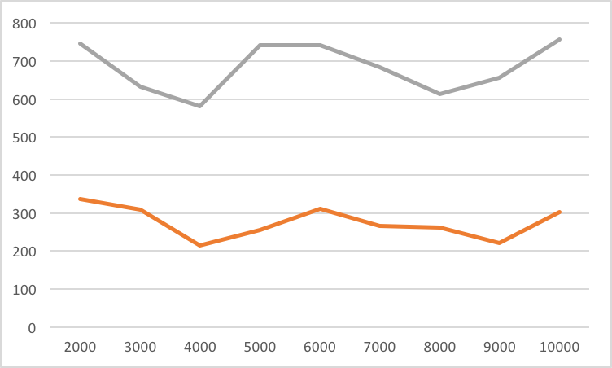
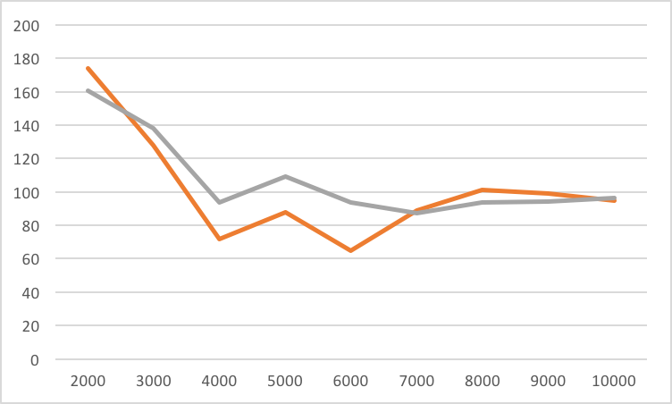

# OSP2Project - Thread

This project is the OSP 2 student project of module Task.

# Group name

XXL

# Group member

* Yuhao Liu (SUID:444219389)
* Shuchang Liu (SUID:968892838)

# Project work

## Tasks

|Tasks		|Status	|Assignment	|
|-----------|-------|-----------|
|Implement FIFO scheduling	|Completed|Yuhao Liu are the major contributor to this part|
|Implement Round Robin scheduling	|Completed|Shuchang Liu are the major contributor to this part|
|Record performance of both scheduling	|Incomplete|Both members contributed to this part|

## Design

In terms of do_create(), do_kill(), do_suspend(), and do_resume(), FIFO and RR are basically the same. The differences resides in the dispatch operation.

In FCFS scheduling, new processes go to the end of the queue. When the scheduler needs to run a new thread, it picks the thread from the head of the queue. The thread will run to the end unless there is a block. If the thread has to block, it enters the waiting state and the scheduler picks another thread from the head of the queue.

In Round-Robin scheduling, threads are dispatched in a FIFO sequence but each thread is allowed to run for only a limited time slice. If the thread does not complete or gets blocked, the time slice expires and the process is preempted. This preempted thread is placed at the tail of the queue where it must wait for all the threads that were already in the queue to cycle through the CPU.

## Performance analysis

The experiment estimated the performance of this two scheduling algorithms in different situations. The other parameter taken into count are the average length of thread. The performance is estimated through two features: throughput and average response time. 

We tested performance features for thread length from 2000 clock cycles to 10000 clock cycles. And compare the features between the two algorithm.

Here is the result for response time:

In the diagram, the yellow line represent Round-Robin scheduling and the gray line represent FIFO scheduling. Every point in the diagram is an average of two test in identical parameters. We can see from the diagram that the response time is much smaller using Round-Robin, and there is not much difference when applying threads of different length. Still, it is possible to generate different result when the thread length grow much larger. 

Here is the result for throughput:

In the diagram, the yellow line represent Round-Robin scheduling and the gray line represent FIFO scheduling. Every point in the diagram is an average of two test in identical parameters. We can see that the Round-Robin generates a little bit lower throughput when thread life expectancy is shorter. It may due to the time comsumption of timer interrupt. But when thread grows larger, the influence of timer interrupt becomes smaller, and the two line begin to converge.

# Customized output:

In Log: Search for "My" or "XXL" notation, XXL is our group signature. 

In terminal: There will be procedure logs on all ThreadCB functions.